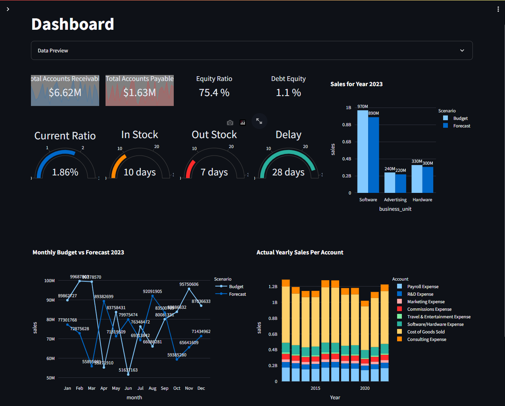

# Streamlit Dashboard
- recreate Excel dashboards within Python web apps. No more struggling with complex VBA macros – empower yourself to generate interactive and visually appealing dashboards for financial data analysis.

## DEMO
 - You can try the project live [here](https://8501-01j0bv4h1g771v2shtqjfpr66t.cloudspaces.litng.ai/)

## Libraries Used
 - plotly
 - duckdb
 - openpyxl
 - streamlit

## Installation
 1. Prerequisites
    - Git
    - Command line familiarity
 2. Clone the Repository: `git clone https://github.com/NebeyouMusie/Streamlit-Dashboard.git`
 3. Create and Activate Virtual Environment (Recommended)
    - `python -m venv venv`
    - `source venv/bin/activate` for Mac and `venv/bin/activate` for Windows
 4. Navigate to the projects directory `cd ./Streamlit-Dashboard` using your terminal
 5. Install Libraries: `pip install -r requirements.txt`
 6. run `streamlit run app/app.py`
 7. open the link displayed in the terminal on your preferred browser

## Usage
1. Download the csv file `Financial Data Clean.xlsx` from the `data` directory.
2. Use the streamlit sidebar to upload the csv file to the sreamlit app
3. You will automatically see the data preview and visualizations

## Collaboration
- Collaborations are welcomed ❤️

## Acknowledgments
 - I would like to thank [Fanilo Andrianasolo](http://www.youtube.com/@andfanilo)
   
## Contact
 - LinkedIn: [Nebeyou Musie](https://www.linkedin.com/in/nebeyou-musie)
 - Gmail: nebeyoumusie@gmail.com
 - Telegram: [Nebeyou Musie](https://t.me/NebeyouMusie)
